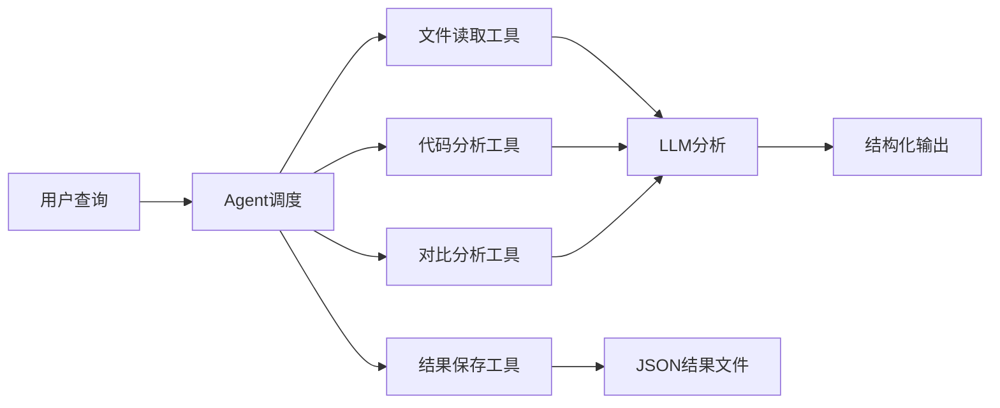

# OpenBLAS 算子优化策略分析工具 - LangChain Agent版本

基于 **LangChain框架** 和 **通义千问大模型** 自动化分析OpenBLAS算子库中的优化策略，帮助开发者深入理解高性能计算中的核心优化技术。

## 🚀 新版本特性

- ✨ **LangChain Agent架构** - 更智能的多工具协作分析
- 🤖 **通义千问API集成** - 稳定可靠的中文大模型支持
- 💬 **交互式分析模式** - 支持实时问答和深度探讨
- 🔧 **工具化设计** - 模块化的分析工具，易于扩展
- 📊 **结构化输出** - JSON格式保存，便于后续处理

## 项目概述

本工具设计用于系统性地分析OpenBLAS中的算子优化策略，通过LangChain Agent架构调用大模型API对关键代码片段进行深度分析，提取出：

- **SIMD向量化优化技术** (SSE, AVX, AVX-512)
- **寄存器分块策略** (Register Blocking)
- **内存访问优化** (Cache-friendly patterns)
- **指令级并行技术** (FMA, Pipeline)
- **架构特化优化** (CPU-specific optimizations)

## 分析策略

### 三层递进分析法

1. **Level 1: AXPY算子** - 学习基础SIMD优化
   - 标量vs向量化对比
   - SIMD指令分析
   - 数据对齐和循环展开

2. **Level 2: DOT算子** - 理解规约操作优化  
   - 水平加法技术
   - 数据重排策略
   - 数值稳定性考虑

3. **Level 3: GEMM微内核** - 掌握高级优化技巧
   - 寄存器分块设计
   - 数据重用最大化
   - 融合乘加指令优化

## 快速开始

### 环境要求

```bash
# Python 3.8+
pip install -r requirements.txt
```

### 依赖安装

```bash
# 一键安装所有依赖
pip install -r requirements.txt

# 或手动安装核心依赖
pip install langchain langchain-openai python-dotenv pydantic
```

### 环境配置

1. **复制配置文件模板**
```bash
cp config_template.env .env
```

2. **设置API密钥**
编辑 `.env` 文件，填入你的通义千问API密钥：
```env
DASHSCOPE_API_KEY=your_qwen_api_key_here
```

3. **配置分析参数（可选）**
创建或编辑 `config.json` 文件来自定义分析：
```json
{
  "model": {
    "name": "qwen-plus-2025-09-11",
    "temperature": 0.3,
    "max_tokens": 4000
  },
  "paths": {
    "openblas_path": "./OpenBLAS-develop",
    "output_dir": "./analysis_results"
  },
  "analysis": {
    "sequence": [
      {
        "algorithm": "axpy",
        "description": "AXPY算子 - 基础SIMD学习",
        "files": [
          {
            "path": "kernel/generic/axpy.c",
            "type": "generic",
            "description": "通用C语言实现"
          },
          {
            "path": "kernel/x86_64/daxpy.c",
            "type": "reference", 
            "description": "x86_64参考实现"
          }
        ]
      }
    ]
  }
}
```

4. **获取API密钥**
   - 访问 [阿里云灵积模型服务](https://dashscope.aliyuncs.com/)
   - 注册账号并获取API密钥
   - 确保账号有足够的调用额度

### 基本使用

```bash
# 使用默认配置进行批量分析
python analyze.py

# 使用自定义配置文件
python analyze.py --config my_config.json

# 交互式分析模式 - 实时问答
python analyze.py --interactive

# 组合使用
python analyze.py --config custom.json --interactive
```

## 使用模式

### 🤖 批量分析模式

自动按序分析预设的算子文件，适合系统性学习：

```bash
python analyze.py
```

**分析序列：**
```
Level 1: AXPY算子
  ├── kernel/x86_64/daxpy.c (C参考实现)
  ├── kernel/x86_64/axpy_sse2.S (SSE2优化)  
  └── kernel/x86_64/daxpy_microk_skylakex-2.c (AVX-512优化)

Level 2: DOT算子
  ├── kernel/x86_64/ddot.c (C参考实现)
  └── kernel/x86_64/ddot_microk_skylakex-2.c (AVX-512优化)

Level 3: GEMM微内核
  ├── kernel/generic/gemm_kernel_4x4_generic.c (通用实现)
  ├── kernel/x86_64/dgemm_kernel_4x8_skylakex.c (高级优化)
  └── kernel/x86_64/sgemm_direct_skylakex.c (直接计算优化)
```

### 💬 交互式分析模式

支持实时问答，可以深入探讨特定技术点：

```bash
python analyze.py --interactive
```

**示例问答：**
```
请输入你的问题: AXPY算子使用了哪些SIMD优化技术？

回答: AXPY算子在OpenBLAS中主要使用了以下SIMD优化技术：

1. **SSE2向量化**: 使用128位寄存器，一次处理2个双精度浮点数
2. **AVX优化**: 使用256位寄存器，并行度提升到4个双精度数
3. **循环展开**: 展开4-8倍循环，减少分支跳转开销
4. **数据预取**: 使用prefetch指令提前加载数据到缓存
5. **内存对齐**: 确保数据按向量宽度对齐，提高访存效率
...
```

## LangChain Agent架构

### 核心组件

1. **LLM模型**: 通义千问 qwen-plus
2. **Agent工具集**:
   - `analyze_code` - 分析单个代码文件
   - `compare_implementations` - 对比不同实现版本
   - `read_openblas_file` - 读取源码文件
   - `save_analysis_result` - 保存分析结果

3. **智能Prompt系统**:
   - 针对不同算子类型的专门化prompt
   - 自动识别分析类型和重点
   - 中文专业术语和技术解释

### 工具协作流程



## 输出结果

每个分析会生成JSON格式的结果文件：

```json
{
  "file_path": "kernel/x86_64/daxpy.c",
  "algorithm": "axpy",
  "analysis_type": "reference",
  "analysis": "详细的技术分析内容...",
  "timestamp": "2025-01-21 10:30:00"
}
```

**结果文件命名规则**: `{algorithm}_{analysis_type}_{timestamp}.json`

## 高级用法

### 自定义分析器

```python
from analyze import OpenBLASAnalyzer, AnalysisConfig

class CustomAnalyzer(OpenBLASAnalyzer):
    def __init__(self, config):
        super().__init__(config)
        # 自定义分析序列
        self.analysis_sequence = [
            {
                "algorithm": "axpy",
                "files": [
                    {"path": "kernel/x86_64/daxpy.c", "type": "reference"}
                ]
            }
        ]

# 使用自定义分析器
config = AnalysisConfig(output_dir="./custom_results")
analyzer = CustomAnalyzer(config)
analyzer.run_complete_analysis()
```

### 扩展新的工具

```python
from langchain_core.tools import tool

@tool("custom_analysis_tool")
def custom_analysis_tool(code_content: str) -> str:
    """自定义分析工具"""
    # 实现你的分析逻辑
    return "分析结果"

# 添加到分析器中
analyzer.tools.append(custom_analysis_tool)
```

## 命令行参数

| 参数 | 描述 | 默认值 |
|------|------|--------|
| `--config` | JSON配置文件路径 | `config.json` |
| `--interactive` | 启动交互式模式 | `False` |

### JSON配置文件说明

配置文件支持以下选项：

- **model**: 大模型相关配置
  - `name`: 模型名称（默认：qwen-plus-2025-09-11）
  - `temperature`: 温度参数（默认：0.3）
  - `max_tokens`: 最大令牌数（默认：4000）

- **paths**: 路径配置
  - `openblas_path`: OpenBLAS源码路径（默认：./OpenBLAS-develop）
  - `output_dir`: 分析结果输出目录（默认：./analysis_results）

- **analysis**: 分析序列配置
  - `sequence`: 自定义分析的算子和文件列表

- **prompts**: 提示词配置
  - `system_message`: 系统消息
  - `analysis_focus`: 分析重点列表

## 示例演示

运行示例脚本查看详细用法：

```bash
python example_usage.py
```

示例包含：
- ✅ 环境检查和配置验证
- 🔄 基础批量分析演示
- 💭 交互式问答演示
- 🛠️ 自定义分析器示例
- 🔧 Agent工具使用演示

## 最佳实践

### 1. 循序渐进学习
- 先理解Level 1的基础优化
- 再学习Level 2的规约技术  
- 最后掌握Level 3的高级技巧

### 2. 交互式深度探索
- 使用交互模式探讨感兴趣的技术点
- 可以追问具体的实现细节
- 对比不同架构的优化差异

### 3. 批量分析建立知识库
- 运行完整的批量分析
- 保存所有结果作为参考资料
- 定期更新和补充分析内容

### 4. 自定义扩展
- 根据需求添加新的算子分析
- 扩展工具集处理特定需求
- 调整prompt模板优化分析质量

## 故障排除

### 常见问题

1. **API密钥错误**
   ```
   请检查 .env 文件中的 DASHSCOPE_API_KEY 是否正确设置
   ```

2. **OpenBLAS路径不存在**
   ```
   确保 OpenBLAS-develop 目录存在，或使用 --openblas-path 指定正确路径
   ```

3. **依赖缺失**
   ```bash
   pip install -r requirements.txt
   ```

4. **网络连接问题**
   ```
   检查网络连接，确保可以访问 https://dashscope.aliyuncs.com/
   ```

### 调试模式

启用详细日志查看Agent执行过程：

```python
analyzer = OpenBLASAnalyzer(config)
# Agent executor 默认已启用 verbose=True
```

## 技术架构

### 核心设计理念

1. **代码切片分析法** - 将复杂算子库切分为易于分析的片段
2. **层次化学习路径** - 从简单到复杂的递进式学习
3. **Agent协作模式** - 多工具协同完成复杂分析任务
4. **专家系统思维** - 利用大模型的专业知识进行深度分析

### 系统架构图

```
┌─────────────────┐    ┌──────────────┐    ┌─────────────────┐
│   User Input    │───▶│ LangChain    │───▶│  Qwen LLM API   │
│                 │    │   Agent      │    │                 │
└─────────────────┘    └──────┬───────┘    └─────────────────┘
                              │
                    ┌─────────▼─────────┐
                    │   Tool Executor   │
                    └─────────┬─────────┘
         ┌──────────────┬─────┴─────┬──────────────┐
         ▼              ▼           ▼              ▼
┌─────────────┐ ┌─────────────┐ ┌─────────────┐ ┌─────────────┐
│ File Reader │ │Code Analyzer│ │ Comparator  │ │Result Saver │
│    Tool     │ │    Tool     │ │    Tool     │ │    Tool     │
└─────────────┘ └─────────────┘ └─────────────┘ └─────────────┘
```

## 性能优化

- **智能代码截取**: 自动提取关键代码段，避免token浪费
- **缓存机制**: 文件读取结果缓存，减少重复I/O
- **并行处理**: 支持多文件并行分析（计划中）
- **增量分析**: 只分析变更的文件（计划中）

## 贡献指南

欢迎贡献代码和改进建议：

- 🆕 新增算子分析支持
- 🎯 优化prompt模板设计
- 🔧 改进Agent工具功能
- 📊 扩展输出格式和可视化
- 🌐 支持更多大模型API

### 开发环境

```bash
# 克隆项目
git clone <repository-url>
cd analyze_OB

# 安装开发依赖
pip install -r requirements.txt

# 配置环境变量
cp config_template.env .env
# 编辑 .env 文件添加API密钥

# 运行测试
python example_usage.py
```

## 许可证

MIT License - 详见 LICENSE 文件

## 更新日志

### v2.0.0 (LangChain Agent版本)
- ✨ 重构为LangChain Agent架构
- 🤖 集成通义千问API
- 💬 新增交互式分析模式
- 🔧 工具化设计，易于扩展
- 📚 完善的示例和文档

### v1.0.0 (原始版本)
- 🎯 基础的OpenBLAS算子分析
- 📋 三层递进分析策略
- 💾 JSON格式结果输出 